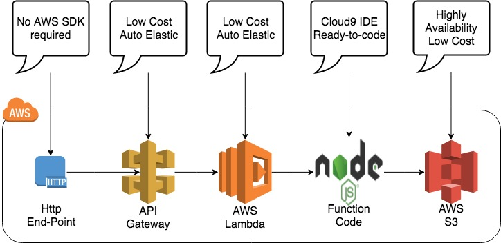

# File Box Api

## Overview



* A proof-of-concept to deliver a micro-service using AWS API-Gateway + Lambda instead of deploying a service to an ec2 instance or to a container
* API-Gateway and Lambda offer following advantages:
  * Auto-scaling is completely abstracted, both API-Gateway and Lambda scale out and in transparently with no configuration or monitoring required
  * Pay-per-use model where API-Gateway cost is [$3.50 per million requests (plus cost of data transfer out)](https://aws.amazon.com/api-gateway/pricing/?sc_channel=PS&sc_campaign=acquisition_CA&sc_publisher=google&sc_medium=api_gateway_b&sc_content=sitelink&sc_detail=aws%20api%20gateway&sc_category=api_gateway&sc_segment=pricing&sc_matchtype=p&sc_country=CA&s_kwcid=AL!4422!3!161187580957!p!!g!!aws%20api%20gateway&ef_id=WkcOJgAAACoKZGTO:20180305021143:s) and AWS-Lambda cost is [$0.20 per million requests](https://aws.amazon.com/lambda/pricing/)
  * Development and deployment can be automated similar to container and/or ec2 automation
  * AWS offers a [Cloud9 cloud IDE](https://docs.aws.amazon.com/cloud9/latest/user-guide/lambda-functions.html) to streamline development and testing of API-Gateway + Lambda with zero footprint on the developer desktop
* Create a simple to use API to upload/download files to abstract consumers from incorporating aws sdk
* The end-point will use a lightway Node.js as a mostly pass-through requests to S3 bucket
* Restful design patern will be used to streamline adoption of the API
* Aws API-Gateway + Lambda will be used insead of ec2 self-hosting to reduce TCO and to increase elasticity
* S3 Buckets will be used to store the files for out-of-the-box high availability support and to reduce TCO for storage space
* Authentication and Authorization shall not use aws tokens to isolate consumers from aws sdk, instead it will rely on configuration json file stored in lambda environment variable
* A decision is required: API Gateway tends to issue unique host names with every deployment making integration testing challening, suggestion is to leverage [AWS Route 53](https://aws.amazon.com/route53/pricing/) to automate the process of updating CNAME with the deployment

## Requirements

1. Build Node.js Restful end-point to upload/download files
2. The end-point should support aws-api-gateway + lambda
3. The end-point will be reading/writing files from/to s3 or mocked storage depending on the configuration
4. Deployment of the end-point to aws-api-gateway/lambda and to ec2 instance is to be automated using terraform and bash scripts
5. Code to be committed to the repository
6. Unit tests and integration test will be required
7. Logging at error/warning/info levels to be redirected to AWS CloudWatch for both deployment models
8. Configuration must use lambda environment variables for lambda deployment and ec2 launch script for ec2 deployment to populate environment variables
9. Documentation with sample request/response will use a Markdown format and Swagger

## Use Cases

1. Store mulitple versions of the same document with an option to limit old version to N
2. Support ttl for automatic files expiry and purging

## [API Design](./docs/API.md)

## [Authentication and Authorization](./docs/AuthC&AuthZ.md)

## [Storage Design](./docs/StorageDesign.md)

## Deployment

1. Change mode: `chmod +x ./aws/*.sh`

2. Set AWS Credentials and Region 
```
export AWS_ACCESS_KEY_ID=YOUR-ACCESS-KEY-ID  
export AWS_SECRET_ACCESS_KEY=YOUR-SECRET-ACCESS-KEY  
export AWS_DEFAULT_REGION=YOUR-DEFAULT-REGION-ID  
export LAMBDA_FUNCTION_NAME=YOUR-FUNCTION-NAME  
export S3_BUCKET_NAME=YOUR-BUCKET-NAME  
export LAMBDA_ROLE_NAME=YOUR-ROLE-NAME  
```

3. Create Lambda Role `./aws/create-lambda-role.sh $LAMBDA_ROLE_NAME`

4. Create Lambda Function `./aws/create-lambda.sh $LAMBDA_FUNCTION_NAME $LAMBDA_ROLE_NAME $S3_BUCKET_NAME`

5. Create Api GateWay
```
sudo python3.6 -m pip install boto3  
python3.6 ./aws/api-gateway/create-api.py $LAMBDA_FUNCTION_NAME
```

6. Create Bucket: `./aws/create-bucket.sh $S3_BUCKET_NAME`
  
## Development

1. Install packages: `npm install`
2. Update lambda: `./aws/create-lambda.sh $LAMBDA_FUNCTION_NAME`
3. Deployed version: https://2ljn2ez51l.execute-api.us-east-2.amazonaws.com/test/$docs